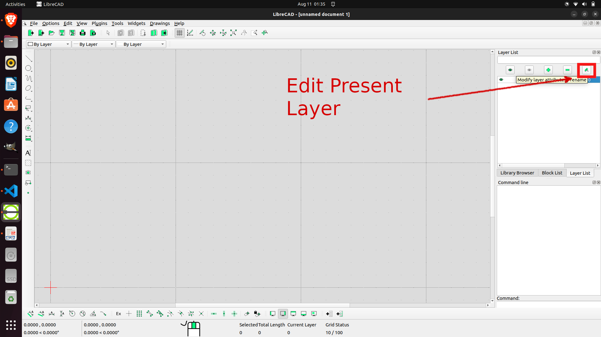
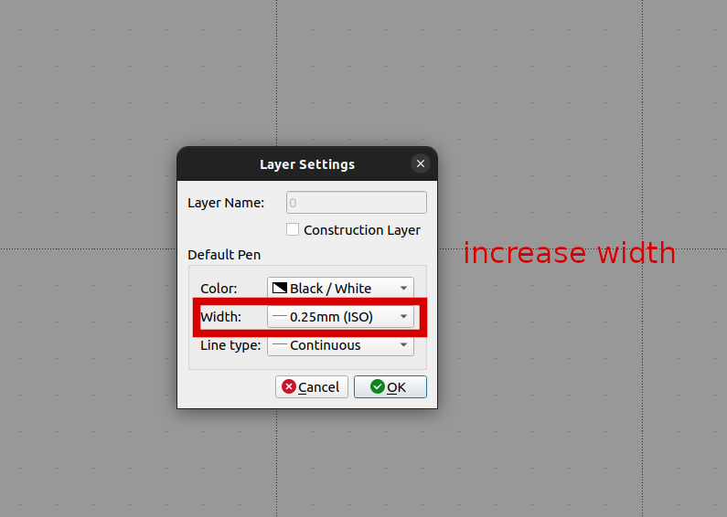
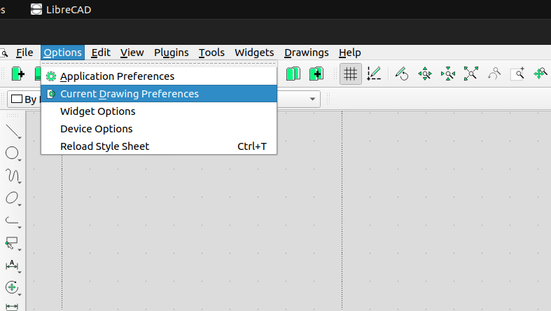
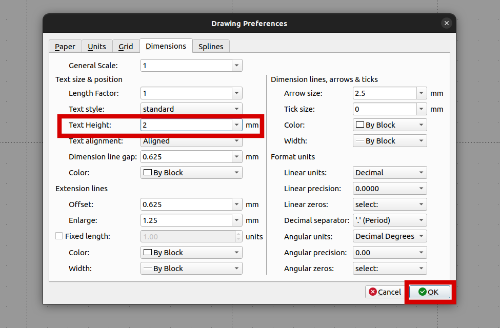

# 1 Create A Template 

## 1.1 Preparations

1. -  Edit present Layer 



- Set Layer Settings value 



2.  Check Current Drawing preferences

- Go to current drawing preference



- Edit Current Drawing preference 

```
- Paper: Select A4 Format, Orientation Landscape, and pay attention to the dimensions: Width 297 mm, Height 210 mm
- Units: Main drawing unit Millimeter, Format Decimal, precision 0.0000 (precision machinery today go to a thousandth of a millimeter or less – in construction engineering an inch is a precise measure)
- Grid: Default selections are OK (Grid on, Orthogonal, etc.)
- Dimensions: Change Text Height to 2 mm, leave the rest as they are
- Splines: No actions
```



## 1.2 Draw the Border

1. 