# 1 Create A Template 

## 1.1 Preparations

1. -  Edit present Layer 


- Set Layer Settings value 

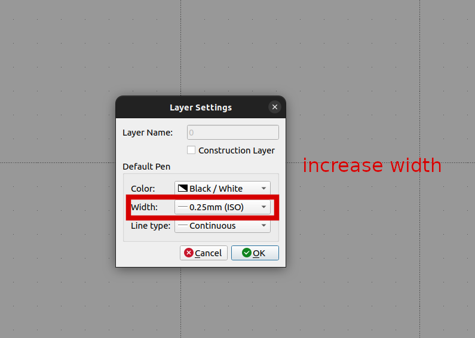

2.  Check Current Drawing preferences

- Go to current drawing preference

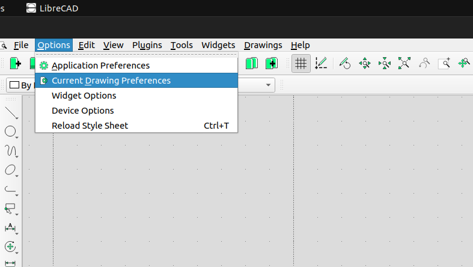

- Edit Current Drawing preference 

```
- Paper: Select A4 Format, Orientation Landscape, and pay attention to the dimensions: Width 297 mm, Height 210 mm
- Units: Main drawing unit Millimeter, Format Decimal, precision 0.0000 (precision machinery today go to a thousandth of a millimeter or less – in construction engineering an inch is a precise measure)
- Grid: Default selections are OK (Grid on, Orthogonal, etc.)
- Dimensions: Change Text Height to 2 mm, leave the rest as they are
- Splines: No actions
```


## 1.2 Draw the Border

1. Draw the outer rectangle, we are going to draw a 277x190 mm rectangle, as an A4 page is 297x210 mm 

go to cammand box , type the followign commands lines after each line type enter 

```
rec
0, 0 
277, 190
```
for auto-zoom , and rectangle to be visible, Enter in the same command-box
```
za
```
Press [**Esc**] to end the task


2. Draw 2mm thick Boarder parallel lines

- Extend Rectangle 2mm left 

```
li
0,0
0,-2
```
- Extend Rectangle 2mm down
```
li
0,0
-2,0
```
- Draw Boarder parallel lines
```
li
-2, -2
277,-2
li
-2,-2
-2,190
```

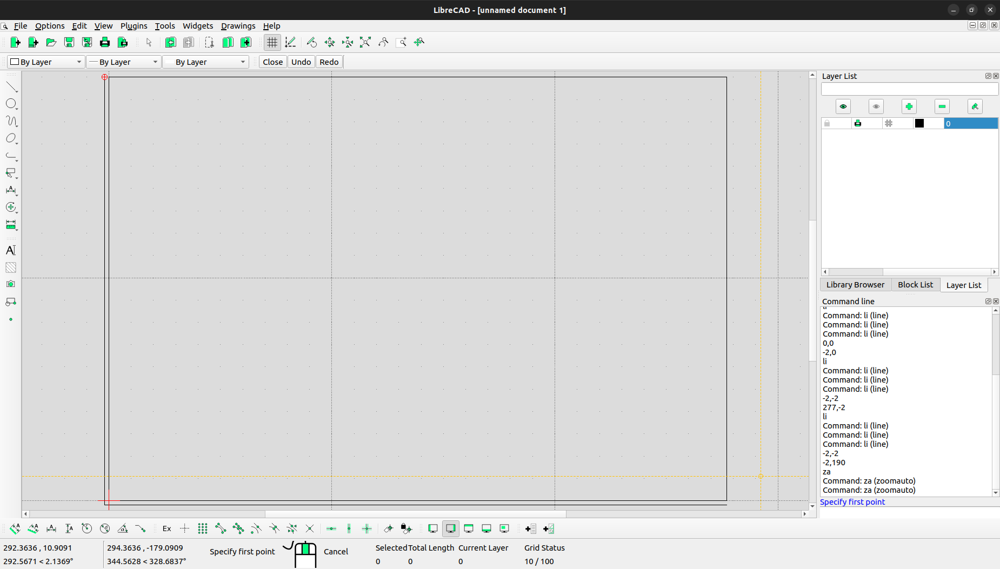

## 1.3 Draw the title block

To Create a Title bock run the follwing commands 
```
li
167, 0
167, 40
277, 40

li
197, 0
197, 40

li
247, 0
247, 40

li
167, 10
277, 10

li
197, 30
277, 30

li
247, 20
277, 20
```
the result of the above commands would be like this 

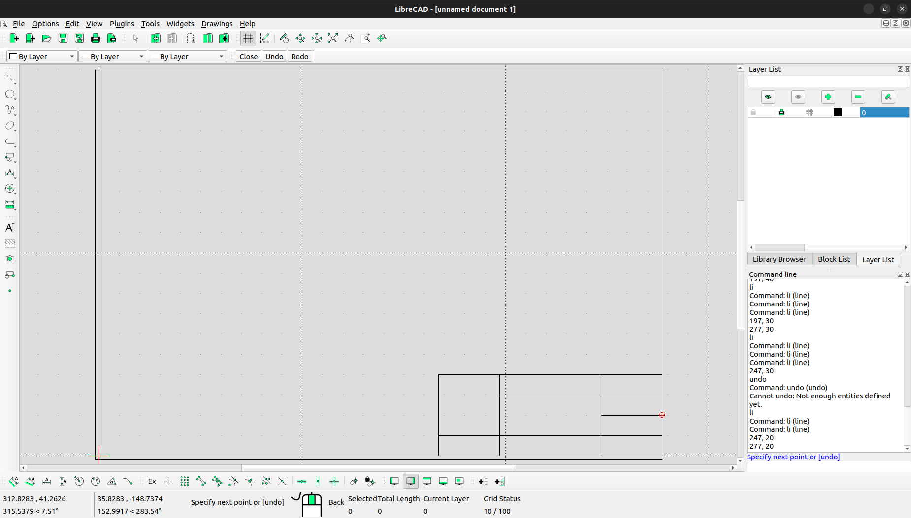

## 1.4 Add Text To the Title Block

- Go to `Tools` then select `MText`

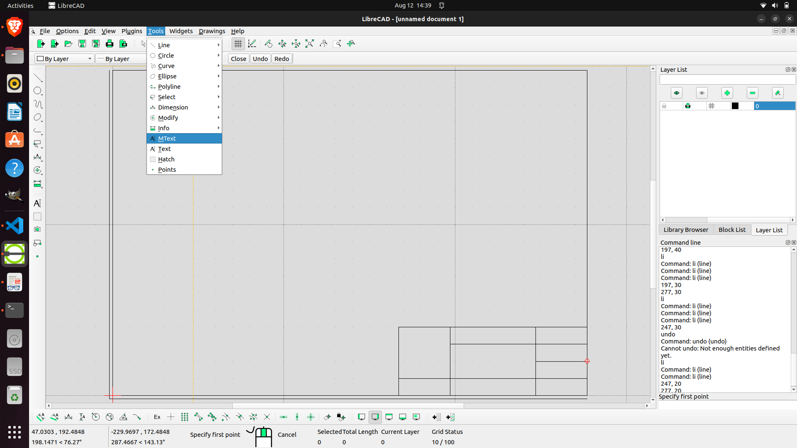

- Check `Alingment, Text height , Text content` 


- Place the MText at right Position


- Repeate The process for remaining texts till you get this 

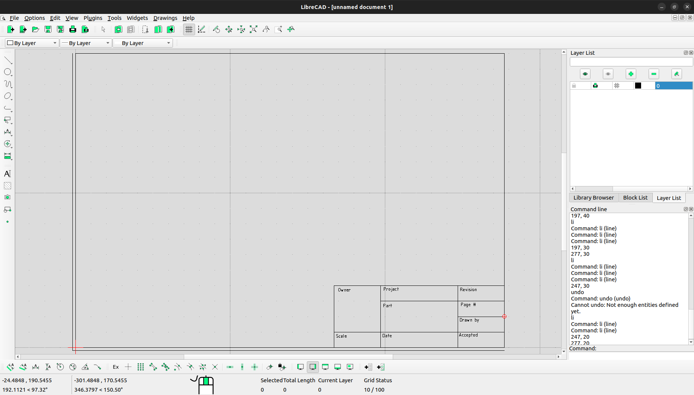

## 1.5 Add Image to Title Block

- Import Image/Symbol you want in Title Box

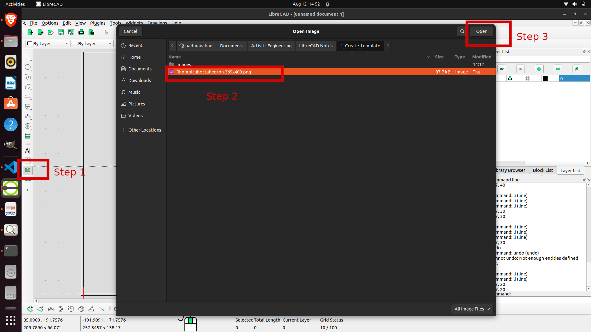

- Now auto-scale to check if the image fits correctly 

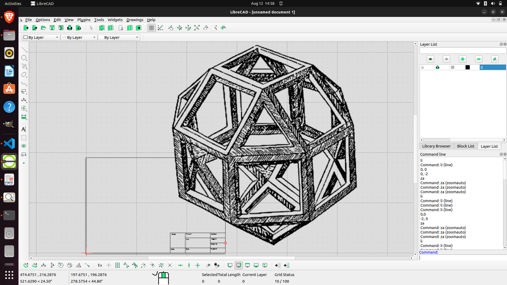

- To scale down select `Scale`


- Set Target Scale down point , and target Scale-down ratio


- Scale Downed Image will look like this 


## 1.6 Printing the Template

- Saving the Template 


- Select `File --> Print Preview`


- Print Previwed template would look like this 

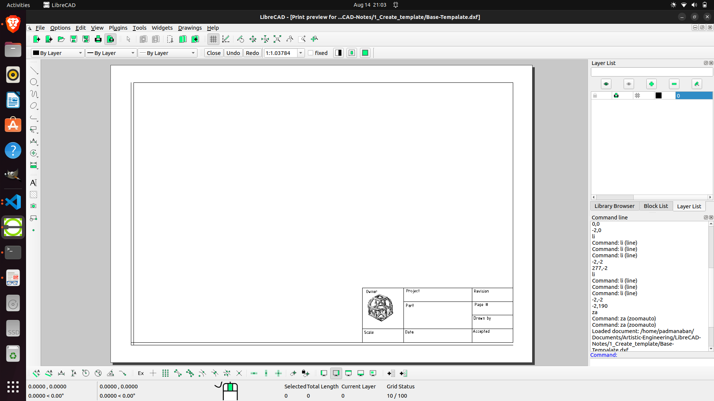

- Print

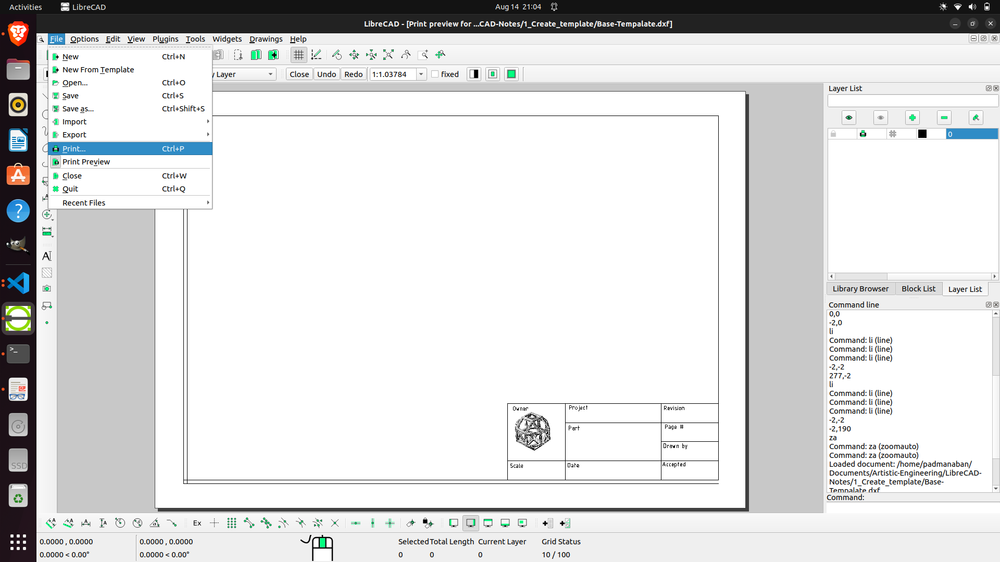

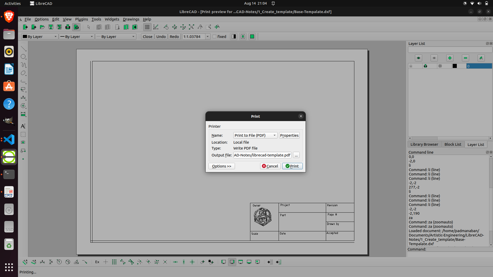